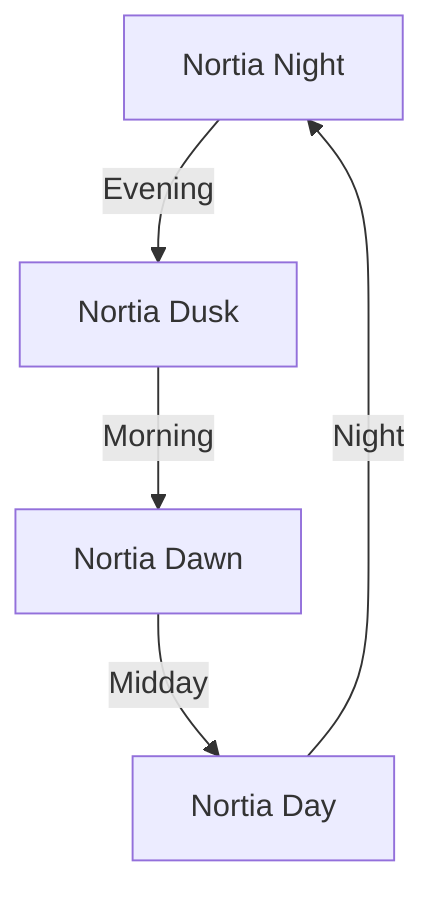

# Nortia Theme Color Showcase

This document demonstrates all the colors and styles in the Nortia theme family (Night, Dusk, Dawn, Day).

## Heading Level 2 - Palette Color 2
### Heading Level 3 - Palette Color 3
#### Heading Level 4 - Palette Color 4
##### Heading Level 5 - Palette Color 5
###### Heading Level 6 - Palette Color 6

---

## Text Styles

This is **normal text** showing the primary foreground color (fg-1). It should be highly readable against the background.

This is *italic text* which uses the same color but with style emphasis.

This is **bold text** for stronger emphasis.

This is ***bold and italic*** for maximum emphasis.

This is ~~strikethrough text~~ to show completed or invalid items.

This is ==highlighted text== using the neutral yellow color for emphasis.

---

## Links

Here's an [[Internal Link]] to another note in your vault.

Here's an [[Internal Link#Section|Link with Alias]] showing hover colors.

Here's an external link: [Nortia on GitHub](https://github.com/alaric/nortia.nvim)

Here's an unresolved link: [[This Note Does Not Exist]]

---

## Lists and Tasks

### Unordered Lists
- First item (list marker in palette-1)
- Second item
  - Nested item
  - Another nested item
    - Deeply nested item
- Third item

### Ordered Lists
1. First numbered item
2. Second numbered item
   1. Nested numbered item
   2. Another nested item
3. Third numbered item

### Task Lists
- [ ] Unchecked task (interactive accent color)
- [x] Completed task (success green color)
- [ ] Another unchecked task
  - [ ] Nested unchecked task
  - [x] Nested completed task
- [x] Task with **bold text**
- [ ] Task with a [[link]]

---

## Code

### Inline Code

Here's some `inline code` showing the code background color.

Variables like `variableName` and functions like `functionName()` are highlighted.

### Code Blocks

```python
# This is a comment (muted fg-4)
import os  # keyword (palette-6)

def calculate_sum(a, b):  # function name (palette-1)
    """This is a docstring"""  # string (palette-3)
    result = a + b  # operator (fg-2)
    return result  # keyword (palette-6)

# Constants and values
MAX_SIZE = 100  # value (palette-5)
PI = 3.14159  # value (palette-5)
```

```javascript
// JavaScript example
const greeting = "Hello, World!";  // string (palette-3)

function processData(input) {  // function (palette-1)
  // Comment showing muted color
  if (input === null) {  // keyword (palette-6)
    return false;  // value (palette-5)
  }

  const result = input * 2;  // operator (fg-2)
  return result;
}

class DataProcessor {  // keyword (palette-6)
  constructor(name) {
    this.name = name;  // property (palette-2)
  }
}
```

```typescript
// TypeScript with type annotations
interface User {  // keyword (palette-6)
  name: string;  // property (palette-2)
  age: number;  // type (palette-1)
  email?: string;
}

function greetUser(user: User): void {  // function (palette-1)
  console.log(`Hello, ${user.name}!`);  // string (palette-3)
}
```

```css
/* CSS example */
.theme-selector {  /* class (palette-1) */
  background-color: #242424;  /* value (palette-5) */
  color: #D6D6D6;  /* value (palette-5) */
  border: 1px solid #3B3B3B;  /* property (palette-2) */
  padding: 10px;  /* value (palette-5) */
}

#main-content {  /* id (palette-1) */
  font-family: "Inter", sans-serif;  /* string (palette-3) */
}
```

---

## Tables

| Column 1 (Header) | Column 2 (Header) | Column 3 (Header) |
|-------------------|-------------------|-------------------|
| Regular row       | Data value        | More data         |
| Alternate row     | Background color  | Alternates        |
| Third row         | Shows borders     | Table styling     |
| Fourth row        | More content      | Final row         |

---

## Blockquotes

> This is a blockquote showing the blockquote border color (palette-1).
>
> It can contain multiple paragraphs.
>
> > And even nested blockquotes.
> >
> > With **bold** and *italic* text.

> [!NOTE]
> This is a callout note using the neutral (yellow) semantic color.

> [!TIP]
> This is a tip callout using the good (green) semantic color.

> [!WARNING]
> This is a warning callout using the warn (orange) semantic color.

> [!ERROR]
> This is an error callout using the bad (red) semantic color.

---

## Tags

#tag1 #project/nortia #color-scheme #theme-demo #obsidian

Tags show up in palette-6 (purple-blue) with subtle backgrounds.

---

## Horizontal Rules

Above and below this text are horizontal rules (dividers):

---

They use the border color from the theme.

---

## Semantic Colors Demo

### Success (Green - Good)
- ✅ Successfully completed task
- 🟢 Active status indicator
- ➕ Addition/new content

### Error (Red - Bad)
- ❌ Failed operation
- 🔴 Error status indicator
- ➖ Deletion/removed content

### Warning (Orange - Warn)
- ⚠️ Warning message
- 🟠 Caution indicator
- 🔄 Modified content

### Info (Yellow - Neutral)
- ℹ️ Information message
- 🟡 Neutral status
- 📝 Note or annotation

---

## Footnotes

Here's a sentence with a footnote[^1].

Here's another with a longer footnote[^2].

[^1]: This is the first footnote showing muted text color.
[^2]: This is a longer footnote with more content. It can contain multiple lines and even **bold** or *italic* text, as well as [[links]].

---

## Math (if you have MathJax enabled)

Inline math: $E = mc^2$

Block math:

$$
\int_{-\infty}^{\infty} e^{-x^2} dx = \sqrt{\pi}
$$

---

## Mermaid Diagrams (if enabled)



---

## Palette Reference

The Nortia themes use 6 carefully chosen palette colors:

1. **Palette 1** (Golden/Dark Gold) - Functions, Types, Headings
2. **Palette 2** (Orange/Red-Orange) - Statements, Properties
3. **Palette 3** (Lime/Olive Green) - Strings
4. **Palette 4** (Pink/Coral) - Preprocessor, Important
5. **Palette 5** (Cyan/Blue) - Constants, Values, Links
6. **Palette 6** (Lavender/Blue-Violet) - Keywords, Tags

---

## Comparison Section

### Night vs Dusk (Dark Themes)
- **Night**: Darkest background (14%) - maximum contrast
- **Dusk**: Lighter dark (22%) - warmer, less stark

### Dawn vs Day (Light Themes)
- **Dawn**: Softer light (94%) - gentle, cozy morning feel
- **Day**: Brightest (98%) - crisp, clear, maximum clarity

---

## Final Notes

This document exercises all major markdown features:
- ✅ All 6 heading levels
- ✅ Text styles (bold, italic, strikethrough, highlight)
- ✅ Links (internal, external, unresolved)
- ✅ Lists (ordered, unordered, nested, tasks)
- ✅ Code (inline and blocks with syntax highlighting)
- ✅ Tables with alternating rows
- ✅ Blockquotes and callouts
- ✅ Tags
- ✅ Horizontal rules
- ✅ Semantic colors in context
- ✅ Footnotes
- ✅ Special elements (math, diagrams)

Switch between **Nortia Night**, **Dusk**, **Dawn**, and **Day** to see how each theme renders this content differently while maintaining the same beautiful color relationships!
